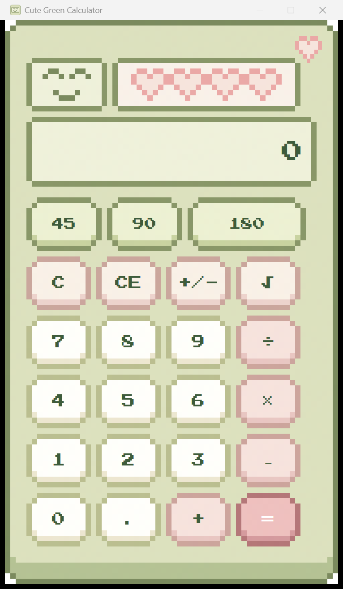

# Cute Green Calculator 🩵

A lightweight, pixel-art desktop calculator for Windows, built with WPF.
It looks like a cozy little handheld gadget and works like a real
four-function calculator — click it, type on your keyboard, or grab it
with the mouse.



## Features

- **Four-function math** — add, subtract, multiply, divide, with chained
  operations (`5 + 3 × 2 =`) and repeat-last-operation on repeated `=`.
- **Square root** (`√`) and sign toggle (`+/-`).
- **Speed-dial buttons** — `45`, `90`, `180` type those digits straight into
  the display in one click, handy for quick angle entry.
- **Full keyboard support** — digits, `.`, `+ - * /`, Enter for `=`, Escape
  for `C`, Delete for `CE`, Backspace to delete a character, F9 for `+/-`,
  and `@` for `√`.
- **Copy/paste** — copy the display with Ctrl+C, paste a number back in
  with Ctrl+V, or use the right-click context menu on the display.
- **Always-on-top toggle** — pin the calculator above other windows.
- Crisp, unblurred pixel art at any Windows display scale (Per-Monitor-V2
  DPI awareness).

## Building and running

**Prerequisites**: Windows, and the [.NET 10 SDK](https://dotnet.microsoft.com/download).

```sh
# Build
dotnet build

# Run
dotnet run --project src/CuteGreenCalculator

# Run the test suite
dotnet test
```

The app project lives at [src/CuteGreenCalculator/](src/CuteGreenCalculator/);
the calculator's core arithmetic logic (independent of any UI) is in
[CalculatorEngine.cs](src/CuteGreenCalculator/CalculatorEngine.cs), covered by
xunit tests in [tests/CuteGreenCalculator.Tests/](tests/CuteGreenCalculator.Tests/).

## Project layout

This project is built and tracked through OpenSpec changes under
[openspec/](openspec/), one per GitHub issue — see `openspec/changes/archive/`
for the history of how each feature was specified and implemented.
